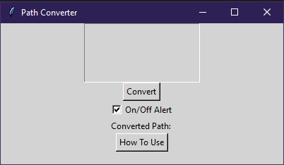

# Python_Path_Converter
A python program made with Tkinter.

Converts paths copied from Windows File Explorer to python friendly paths.

e.g. C:\Users\User\Desktop -> C:/Users/User/Desktop

Refer to "How To Use" button in program for additional information.

